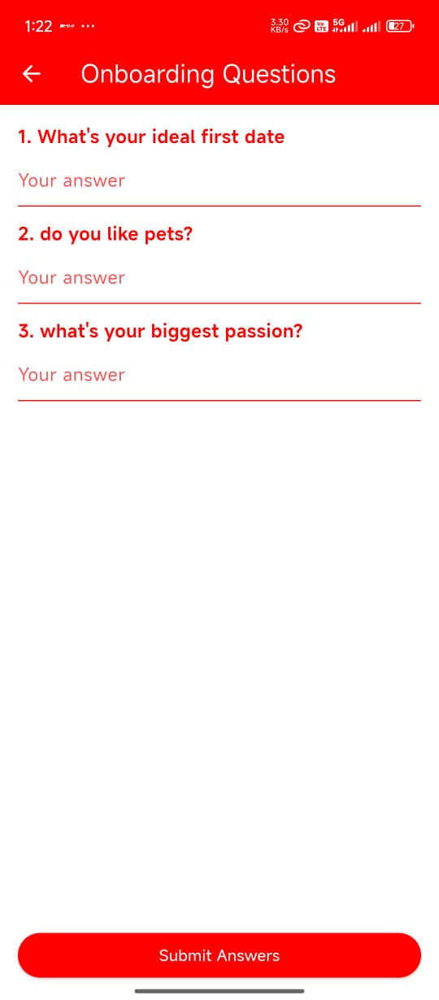

# 📰 Matchbox App

A clean and intuitive Flutter app that simulates key features of an AI platform. The app includes user authentication, chat message , AI-driven match, event joining, and partner finding functionalities. It is designed with a focus on modularity, smooth user experience, and robust state management, utilizing Firebase for authentication and mock APIs for AI interactions..

---

## ✨ Features

- 🔐 User Authentication: Sign up, login, and email verification with Firebase Auth
- ❤️ Find Partener: (Bonus) Visualize the audio waveform and smooth transitions
- 🌐 Responsive Design: Mobile-friendly UI, inspired by Gaia AI's web app style
- 🔄 Error Handling: Graceful error handling for authentication and chat features
- ⏳ Loading Indicators: Show loading spinners and smooth UI transitions

---

## 🚀 Setup Instructions

1. **Clone the repository**:
   ```bash
   git https://github.com/RaviYadavO4/matchbox_app.git.
   cd matchbox_app

2. **Install dependencies:**

- provider: ^6.1.5
- firebase_core: ^3.13.0
- firebase_auth: ^5.5.3
- shared_preferences: ^2.5.3
- uuid: ^4.5.1
- path_provider: ^2.1.5
- just_audio: ^0.10.2
- flutter_sound: ^9.28.0
- permission_handler: ^12.0.0+1
- lutter_spinkit: ^5.2.1
- audioplayers: ^6.4.0
- cloud_firestore: ^5.6.7
- intl: ^0.20.2
- flutter_launcher_icons: ^0.14.3

3. **Run the app**
- flutter run


## 🛠️ Tech Stack
- Tool/Library	    Purpose
- Flutter SDK 3+	Mobile UI Framework
- Provider	        State Management
- firebase_core	        Firebase initialization
- firebase_auth	User    authentication via Firebase
- path_provider	        Access device file system paths
- just_audio	        Audio playback support
- flutter_sound	        Audio recording and playback
- permission_handler	Handle device permissions (microphone, storage, etc.)
- flutter_spinkit	    Show loading spinners and animations
- audioplayers	        Audio playback library
- cloud_firestore	    Cloud database for storing user data and chat history
- intl	                Internationalization and date formatting
- flutter_launcher_icons	Custom app icons for Android and iOS

## 🧠 State Management Explanation

The app uses Provider with ChangeNotifier to manage various aspects of the application state. The AuthProvider handles user authentication, including sign-up, login.


## 📸 Screenshots

<table>
  <tr>
  <td align="center">
    <strong>🏠 Login Screen</strong><br>
    
  </td>
  <td align="center">
    <strong>🏠 Signup Screen</strong><br>
    
  </td>
  <td align="center">
    <strong>🔐 Dashboard Screen</strong><br>
    
  </td>
  <td align="center">
    <strong>📹 Profile Screen</strong><br>
    
  </td>
</tr>


  <tr>
  <td align="center">
    <strong>🔍 Event Screen</strong><br>
    
  </td>
  <td align="center">
    <strong>💬 Onboard Screen</strong><br>
    
  </td>
  <td align="center">
    <strong>📄 Match View</strong><br>
    
  </td>
</tr>

</table>


## 🎥 Video Walkthrough

Watch the video walkthrough for a detailed overview of the app:

<a href="https://youtube.com/shorts/rGZ6TT306Z8" target="_blank">
  
</a>

## 📌 Author

**Ravi Yadav**  
🔗 [GitHub Profile](https://github.com/RaviYadavO4)